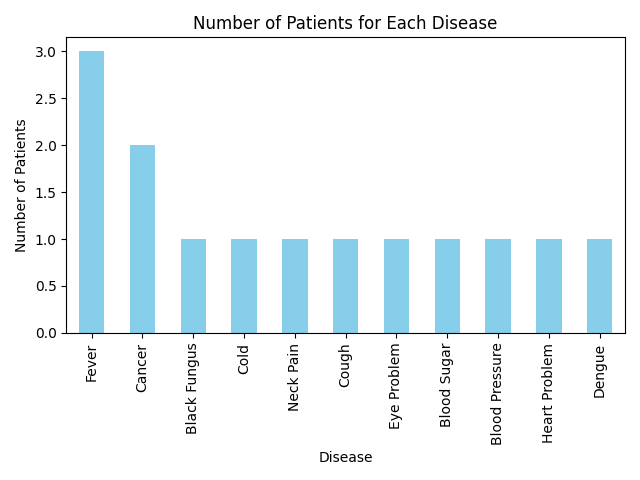

# Patient Management System

A web-based application to manage patient records, built with Flask and Python. The application provides functionalities such as registering patients, searching for patient records, updating patient details, and visualizing patient data through graphs.

---

## Features

### Patient Management
- **Register New Patient**: Add a new patient to the system with details such as ID, name, age, weight, gender, address, phone number, and disease.
- **View All Patients**: List all registered patients with their details.
- **Search Patient**: Search for a specific patient using their unique ID.
- **Update Patient Details**: Modify existing patient information.
- **Delete Patient Record**: Remove a patient's record from the system.

### Data Visualization
- **Disease Count Graph**: Displays the number of patients for each disease in a bar chart.
- **Age Group Graph**: Displays the distribution of age groups for various diseases in a stacked bar chart.

---

## Setup Instructions

### Prerequisites
- Python 3.x
- Flask
- Pandas
- Matplotlib

### Installation

1. Clone this repository:
    ```bash
    git clone https://github.com/your-repo/patient-management-system.git
    cd patient-management-system
    ```

2. Install the required Python packages:
    ```bash
    pip install flask pandas matplotlib
    ```

3. Create necessary directories:
    ```bash
    mkdir csvfile
    ```

4. Create an initial `patientnew.csv` file (optional):
    - Add headers as:
      ```csv
      pid,name,age,weight,gender,address,phoneno,disease
      ```

5. Run the application:
    ```bash
    python app.py
    ```

6. Open the application in your browser:
    ```
    http://127.0.0.1:5000
    ```

---

## Project Structure
```
patient-management-system/
├── app.py              # Main Flask application file
├── templates/          # HTML templates
│   ├── login.html
│   ├── menu.html
│   ├── register.html
│   ├── patients.html
│   ├── update.html
│   ├── search.html
│   ├── graph_disease_count.html
│   └── graph_age_group.html
├── static/             # Static files (e.g., images for graphs)
│   └── *.png
├── csvfile/            # Directory to store CSV files
│   └── patientnew.csv  # Patient database
├── README.md           # Project documentation
└── requirements.txt    # Python dependencies (optional)
```

---

## Usage

1. **Login**: Use `login.html` to authenticate.
2. **Navigate to Menu**: Access the main features like registering patients, viewing patient lists, and generating graphs.
3. **Generate Graphs**:
   - Disease Count Graph: Visualize the number of patients per disease.
   - Age Group Graph: Analyze the age distribution for various diseases.

---

## Screenshots

### Disease Count Graph


---

## Contribution Guidelines

Feel free to submit issues and contribute to the project. Fork the repository and create pull requests for any changes or enhancements.

---

## License
This project is licensed under the MIT License. See `LICENSE` for more details.
